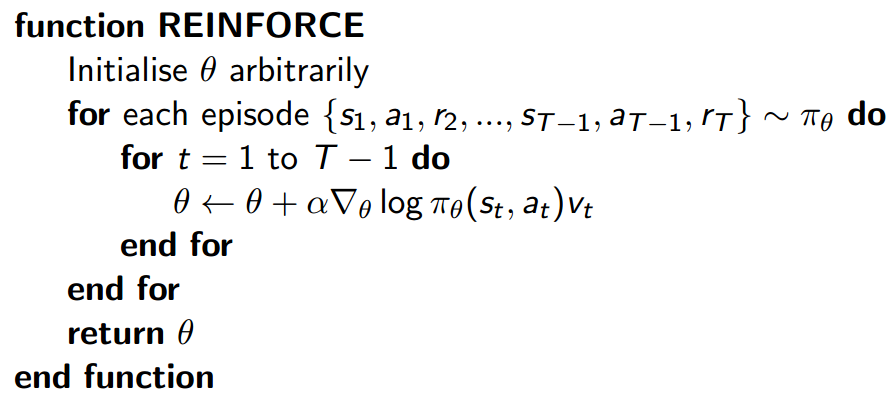
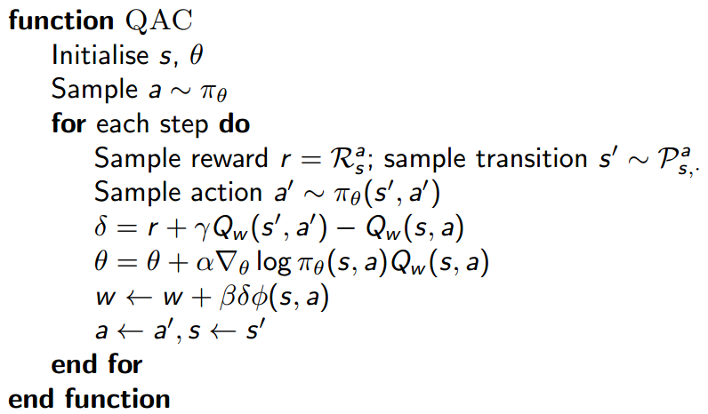

# Lecture07 Policy Gradient

## Introduction

In this lecture we will directly parametrise the policy $$\pi_{\theta}(s, a) = P [a | s; θ]$$, instead of the state-value or action-value.

**Advantages & Disadvantages of Policy-Based RL**

* **Advantages**:

  Better convergence properties

  Effective in high-dimensional or continuous action spaces

  Can learn stochastic policies

* **Disadvantages**:

  Typically converge to a local rather than global optimum

  Evaluating a policy is typically inefficient and high variance

### Policy Search

Goal: given policy $$\pi_{\theta}(s, a)$$ with parameters $$\theta$$, find best $$\theta$$.

But how to measure the quality of a policy $$\pi_{\theta}$$?

* In episodic environments we can use the start value:

  $$J_1(\theta) = V^{\pi_{\theta}}(s_1) = E_{\pi_{\theta}} [v_1]$$

* In continuing environments we can use the average value:

  $$J_{avV} (\theta) = \sum_{s} d^{\pi_0}(s) V^{\pi_0}(s)$$

  Or the average reward per time-step:

  $$J_{avR} (\theta) = \sum_{s} d^{\pi_0}(s) \sum_{a} \pi_{\theta}(s, a) R_s^a$$

  where $$d^{\pi_0}(s)$$ is stationary distribution of Markov chain for $$\pi_{\theta}$$

Policy based reinforcement learning is an optimisation problem, and we focus on gradient descent based methods.

## Finite Difference Policy Gradient

Computing Gradients By Finite Differences

## Monte-Carlo Policy Gradient

We now compute the policy gradient analytically.

Assume policy $$\pi_\theta$$ is differentiable whenever it is non-zero, and we know the gradient $$\triangledown_\theta \pi_\theta(s, a)$$.

**Likelihood ratios** exploit the following identity

$$\triangledown_\theta \pi_\theta(s, a) = \pi_\theta(s, a) \frac{\triangledown_\theta \pi_\theta(s, a)}{\pi_\theta(s, a)} = \pi_\theta(s, a) \triangledown_\theta \log \pi_\theta(s, a)$$

The **score function** is $$\triangledown_\theta \log \pi_\theta(s, a)$$.

### Policy Gradient Theorem

**One-Step MDPs**

Consider a simple class of one-step MDPs

* Starting in state $$s \sim d(s)$$.
* Terminating after one time-step with reward $$r = R(s,a)$$.

Use likelihood ratios to compute the policy gradient:

$$J(\theta) = E_{\pi_{\theta}} [r] = \sum_{s \in S} d(s) \sum_{a \in A} \pi_\theta(s, a) R_{s,a}$$

$$\triangledown_\theta J(\theta) = \sum_{s \in S} d(s) \sum_{a \in A} \pi_\theta(s, a) \triangledown_\theta \log \pi_\theta(s, a) R_{s,a} = E_{\pi_{\theta}} [\triangledown_\theta \log \pi_\theta(s, a) r]$$

**Policy Gradient Theorem**

The policy gradient theorem generalises the likelihood ratio approach to multi-step MDPs.

Replaces instantaneous reward $$r$$ with long-term value $$Q_\pi(s, a)$$

Policy gradient theorem applies to start state objective, average reward and average value objective

> Theorem For any differentiable policy $$\pi_\theta(s,a)$$, for any of the policy objective functions $$J = J_1$$, $$J_{avR}$$, or $$\frac{1}{1-\gamma} J_{avV}$$, the policy gradient is $$\triangledown_\theta J(\theta) = E_{\pi_{\theta}} [\triangledown_\theta \log \pi_\theta(s, a) Q^{\pi_\theta}(s, a)]$$

**Monte-Carlo Policy Gradient \(REINFORCE\)**

Using return $$v_t$$ as an unbiased sample of $$Q^{\pi_\theta}(s_t, a_t)$$.

## Actor-Critic Policy Gradient

Monte-Carlo policy gradient still has high variance, we can use a critic to estimate the action-value function: $$Q_w(s, a) \approx Q^{\pi_\theta}(s, a)$$.

**Actor-critic algorithms** maintain two sets of parameters:

* **Critic** Updates action-value function parameters $$w$$
* **Actor** Updates policy parameters $$\theta$$, in direction suggested by critic.

Actor-critic algorithms follow an approximate policy gradient:

$$\triangledown_\theta J(\theta) = E_{\pi_{\theta}} [\triangledown_\theta \log \pi_\theta(s, a) Q_w(s, a)]$$

$$\triangle \theta = \alpha \triangledown_\theta \log \pi_\theta(s, a) Q_w(s, a)$$

The critic is solving a familiar problem: policy evaluation.

This problem can by solved by Monte-Carlo policy evaluation, Temporal-Difference learning or TD\(λ\).

**Action-Value Actor-Critic**

**Bias in Actor-Critic Algorithms**

Approximating the policy gradient introduces bias.

A biased policy gradient may not find the right solution

Luckily, if we choose value function approximation carefully, then we can avoid introducing any bias, i.e. we can still follow the exact policy gradient.

**Compatible Function Approximation**

> Theorem \(Compatible Function Approximation Theorem\) If the following two conditions are satisfied: 1. Value function approximator is compatible to the policy $$\triangledown_w Q_w(s, a) = \triangle_\theta \log \pi_{\theta}(s, a)$$ 2. Value function parameters w minimise the mean-squared error $$\epsilon = E_{\pi_\theta} (Q^{\pi_\theta}(s, a) − Q_w(s, a))^2$$ Then the policy gradient is exact: $$\triangle_\theta J(\theta) = E_{\pi_\theta} [\triangle_\theta \log \pi_\theta(s, a) Q_w(s, a)]$$

**Reducing Variance Using a Baseline**

We can subtract a baseline function B\(s\) from the policy gradient to reduce variance without changing expectation.

A good baseline is the state value function $$B(s) = V_{\pi_\theta}(s)$$.

So we can rewrite the policy gradient using the advantage function $$A_{\pi_\theta}(s, a)$$:

$$A_{\pi_\theta}(s, a) = Q_{\pi_\theta}(s, a) − V_{\pi_\theta}(s)$$

$$\triangle_\theta J(\theta) = E_{\pi_\theta} [\triangledown_\theta \log \pi_\theta(s, a) A_{\pi_\theta}(s, a)]$$

**Natural Policy Gradient** ?????

