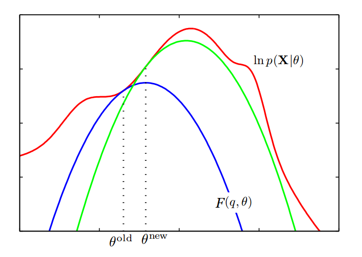

# EM Algorithm

## The General EM Algorithm

### 算法概述

给定观测变量 $$X$$, 和隐变量 $$Z$$ 上的联合分布 $$p(X, Z|\theta)$$, $$\theta$$ 是参数. 目标是要关于 $$\theta$$ 极大化似然函数 $$p(X|\theta)$$.

1. 为参数 $$\theta^{old}$$ 赋一个初始值.
2. **E step**

   计算 $$p(Z|X, \theta^{old})$$.

3. **M step**

   计算 $$\theta^{new}$$: $$\theta^{new} = \arg \max \limits_{\theta} Q(\theta, \theta^{old})$$

   其中 $$Q(\theta, \theta^{old}) = \sum \limits_{Z} p(Z|X, \theta^{old}) \, ln\,p(X, Z|\theta)$$

4. 检查对数似然函数或者参数值的收敛性。

   如果不满足收敛准则，那么令 $$\theta^{old} \leftarrow \theta^{new}$$.然后，回到第2步，继续.

### 算法有效性/收敛性证明

#### 证明1

要证明 EM 算法的有效性/收敛性, 只需要证明每一次迭代可以保证 $$log\,p(X|\theta^{i+1}) = L(X|\theta^{i+1}) \ge L(X|\theta^{i})$$

**证明如下：**

$$L(X|\theta) = log\,p(X|\theta) = log \frac {p(X, Z|\theta)}{p(Z|X, \theta)} = log \, p(X, Z|\theta) - log \, p(Z|X, \theta)$$

等式两边同时关于 $$p(Z|X, \theta^{old})$$ 做积分有：

$$
\begin{aligned}
log \, p(X|\theta) & = \int p(Z|X, \theta^{old})log\,p(X|\theta) \,dZ\\
& = \int p(Z|X, \theta^{old}) log\,p(X, Z|\theta) \, dZ - p(Z|X, \theta^{old}) log\,p(Z|X, \theta) \, dZ \\
& = Q(\theta, \theta^{old}) - \int p(Z|X, \theta^{old}) log\,p(Z|X, \theta) \, dZ
\end{aligned}
$$

下面比较 $$L(\theta^{new})$$ 和 $$L(\theta^{old})$$, 有:

$$
L(\theta^{new}) - L(\theta^{old}) = Q(\theta^{new}, \theta^{old}) - Q(\theta^{old}, \theta^{old}) + \int p(Z|X,\theta^{old}) log\frac{p(Z|X, \theta^{old})}{p(Z|X, \theta^{new})} \,dZ
$$

根据 $$\theta^{new}$$的定义, 可以知道 $$Q(\theta^{new}, \theta^{old}) - Q(\theta^{old}, \theta^{old}) \ge 0$$

根据 KL 距离的非负性, 可以知道 $$\int p(Z|X,\theta^{old}) log\frac{p(Z|X, \theta^{old})}{p(Z|X, \theta^{new})} \,dZ = KL(p(Z|X, \theta^{old}), p(Z|X, \theta^{new})) \ge 0$$

综上,有 $$L(\theta^{new}) - L(\theta^{old}) \ge 0$$, 收敛性得证.

#### 证明2

与前一种证明类似，可以看到: $$L(X|\theta) = log\,p(X|\theta) = log \frac {p(X, Z|\theta)}{p(Z|X, \theta)} = log \, \frac {p(X, Z|\theta)}{q(Z)} + log \, \frac{q(Z)}{p(Z|X, \theta)}$$

其中 $$q(Z)$$ 是引入的一个关于 $$Z$$ 的分布. 两边同时关于 $$q(Z)$$ 求积分, 得到:

$$
\begin{aligned}
log \, p(X|\theta) & = \int q(Z) \, log\,p(X|\theta) \,dZ\\
& = \int q(Z) log\,\frac {p(X, Z|\theta)}{q(Z)} + q(Z) log\, \frac {q(Z)} {p(Z|X, \theta)} \, dZ \\
& = \int q(Z) log\,\frac {p(X, Z|\theta)}{q(Z)} \, d(Z) + KL(q(Z), p(Z|X, \theta)) \\
& = F(q, \theta) + KL(q(Z), p(Z|X, \theta))
\end{aligned}
$$

EM 算法可以视为 通过优化 $$L(X|\theta)$$ 的下界 $$F(q, \theta)$$, 来达到优化 $$L(X|\theta)$$ 的目的.

* 在 **E-step**: 固定 $$F(q, \theta)$$ 中的 $$\theta$$, 关于 $$q(Z)$$ 做优化.

  因为 $$L(X|\theta)$$ 是 $$F(q, \theta)$$ 的上界, 且与 $$q(Z)$$ 无关, 容易看到, 在 $$q(Z) = p(Z|X, \theta)$$时, $$F(q, \theta)$$ 会取得最大值，即为 $$L(X|\theta)$$.

* 在 **M-step**: 固定 $$F(q, \theta)$$ 中的 $$\q(z)$$, 关于 $$\theta$$ 做优化.

  $$\theta = arg \max \limits_{\theta} \int q(Z) log\,\frac {p(X, Z|\theta)}{q(Z)} \, d(Z) = arg \max \limits_{\theta} \int p(Z|X, \theta^{old}) log\, p(X, Z|\theta) \, d(Z)$$

整个过程可以用图示表示如下：

## 应用

### GMM

在 GMM 中, $$p(X|\theta) = \sum_{l=1}^{k}\alpha_{l}N(X|u_{l}, \Sigma_{l})$$

其中 $$\sum_{l=1}^{k}\alpha_{l}=1, \quad \theta = \{\alpha_{1}, ..., \alpha_{k}, u_{1}, ..., u_{k}, \Sigma_{1}, ..., \Sigma_{k}\}$$.

为了做极大似然估计，引入隐变量 $$Z = \{z_{1}, ..., z_{n}\}$$, 其中$$z_{i}$$ 表示的是与观测量 $$x_{i}$$ 相对应的混合成分, $$p(z_{i}) = \alpha_{z_{i}}$$

引入隐变量之后相关的概率计算公式如下：

$$
\begin{aligned}
P(x_{i} | z_{i}) &= N(x_{i} | u_{z_{i}}, \Sigma_{z_{i}}) \\
P(X, Z) &= \prod \limits_{i=1}^{n}p(x_{i}, z_{i}) = \prod \limits_{i=1}^{n}p(x_{i}|z_{i}) p(z_{i}) = \prod \limits_{i=1}^{n}\alpha_{z_{i}}N(x_{i}|u_{z_{i}}, \Sigma_{z_{i}}) \\
P(Z|X, \theta) &= \prod \limits_{i=1}^{n}p(z_{i}|x_{i}) = \prod \limits_{i=1}^{n} \frac{\alpha_{z_{i}}N(x_{i}|u_{z_{i}}, \Sigma_{z_{i}})}{\sum_{l=1}^{k}\alpha_{z_{i}}N(x_{i}|u_{z_{i}}, \Sigma_{z_{i}}) }
\end{aligned}
$$

使用EM算法：

1. **E-step:**

   由前面的公式计算 $$p(Z|X, \theta^{old})$$.

2. **M-step:**

$$
\begin{aligned}
Q(\theta, \theta^{old}) &= \sum \limits_{Z} p(Z|X, \theta^{old}) \, ln\,p(X, Z|\theta) \\
&= \sum \limits_{Z} (\prod \limits_{i=1}^{n}p(z_{i}|x_{i}, \theta^{old})(\sum \limits_{i=1}^{n}ln\,p(z_{i}, x_{i} | \theta))) \\
&= \sum \limits_{Z} \sum \limits_{j=1}^{n} (\prod \limits_{i \neq j}p(z_{i}|x_{i}, \theta^{old})) p(z_{j} | x_{j}, \theta^{old}) ln \, p(x_{j}, z_{j} |\theta)\\
&= \sum \limits_{j=1}^{n} \sum \limits_{Z} (\prod \limits_{i \neq j}p(z_{i}|x_{i}, \theta^{old})) p(z_{j} | x_{j}, \theta^{old}) ln \, p(x_{j}, z_{j} |\theta)\\
&= \sum \limits_{j=1}^{n} \sum \limits_{z_{j}=1}^{k} p(z_{j} | x_{j}, \theta^{old}) ln \, p(x_{j}, z_{j} |\theta) \\
&= \sum \limits_{j=1}^{n} \sum \limits_{l=1}^{k} p(l | x_{j}, \theta^{old}) ln \, \alpha_{l} N(x_{i} | u_{l}, \Sigma_{l}) \\
&= \sum \limits_{j=1}^{n} \sum \limits_{l=1}^{k} p(l | x_{j}, \theta^{old}) (ln \, \alpha_{l} - \frac{D}{2} ln\,2\pi - \frac{1}{2}ln\,|\Sigma| -\frac{1}{2} (x_{j}-u_{l})^{T}\Sigma_{l}^{-1}(x_{j}-u_{l}))
\end{aligned}
$$

**下面分别关于参数** $$\alpha, u, \Sigma$$ **做优化**有：

* **关于** $$\alpha$$ **做优化**

优化时涉及到的相关项为: $$A = \sum \limits_{j=1}^{n} \sum \limits_{l=1}^{k} p(l | x_{j}, \theta^{old}) ln \, \alpha_{l}$$.

同时考虑到约束条件$$\sum_{l=1}^{k}\alpha_{l}=1$$, 使用 Lagrange Multiplier, 有：

$$
\begin{aligned}
LM(\alpha, \lambda) &= \sum \limits_{j=1}^{n} \sum \limits_{l=1}^{k} p(l | x_{j}, \theta^{old}) ln \, \alpha_{l} - \lambda (\sum_{l=1}^{k}\alpha_{l} - 1) \\

\frac {\partial LM(\alpha, \lambda)} {\partial \alpha_{l}} &= \frac {1}{\alpha_{l}} \sum \limits_{j=1}^{n} p(l | x_{j}, \theta^{old}) -\lambda \\

\Rightarrow &\quad \alpha_{l} = \frac {\sum_{j=1}^{n} p(l | x_{j}, \theta^{old})}{n}
\end{aligned}
$$

* **关于** $$u$$ **做优化**

优化时涉及到的相关项为: $$B = -\frac{1}{2} \sum \limits_{j=1}^{n} \sum \limits_{l=1}^{k} p(l | x_{j}, \theta^{old}) (x_{j}-u_{l})^{T}\Sigma_{l}^{-1}(x_{j}-u_{l})$$.

关于 $$u$$ 求偏导数有：

$$
\begin{aligned}
\frac {\partial B} {\partial u_{l}} &= - \frac{1}{2} \sum \limits_{j=1}^{n} p(l | x_{j}, \theta^{old}) \Sigma_{l}^{-1}(x_{i}-u_{l}) (-2) \\

\Rightarrow &\quad u_{l} = \frac {\sum_{j=1}^{n} p(l | x_{j}, \theta^{old}) x_{j}} {\sum_{j=1}^{n} p(l | x_{j}, \theta^{old})}
\end{aligned}
$$

* **关于** $$\Sigma$$ **做优化**

优化时涉及到的相关项为: $$C = \sum \limits_{j=1}^{n} \sum \limits_{l=1}^{k} p(l | x_{j}, \theta^{old}) (\frac{1}{2}ln\,|\Lambda| -\frac{1}{2} (x_{j}-u_{l})^{T} \Lambda (x_{j}-u_{l})))$$. 其中 $$\Lambda_{l} = \Sigma_{l}^{-1}$$

关于 $$\Lambda_{l}$$ 求偏导数有：

$$
\begin{aligned}
\frac {\partial C} {\partial \Lambda} &= \frac{1}{2} \sum_{j=1}^{n} p(l|x_{j}, \theta^{old}) (\Lambda_{l}^{-1} - (x_{j}-u_{l})(x_{j}-u_{l})^{T})\\
\\
\Rightarrow &\quad \Sigma_{l} = \Lambda_{l}^{-1} = \frac {\sum_{j=1}^{n} p(l|x_{j}, \theta^{old}) (x_{j}-u_{l})(x_{j}-u_{l})^{T})}{\sum_{j=1}^{n} p(l|x_{j}, \theta^{old})}
\end{aligned}
$$

上面的求导过程中用到了一些矩阵的导数公式, 可以参考 PRML 中 Appendix C. Properties of Matrices.

### K-Means

K-Means是一种硬聚类的手段，把每个点唯一的关联到一个聚簇. 可以通过下面的手段从 GMM 的 EM 算法中导出 K-Means 算法.

首先，假定 GMM 中每个混合成分的共享协方差矩阵 $$\epsilon I$$, 此时 $$p(x|u_{l}, \Sigma_{l}) = \frac{1}{\sqrt{2 \pi \epsilon}} exp \{-\frac{1}{2\epsilon} ||x-u_{l}|| \}$$

将 $$\epsilon$$ 视为一个固定的常数，而不是一个待估计的参数。

在上述假定下，应用 EM 算法有：

$$
p(l | x_{i}, \theta) = \frac{\alpha_{l} exp(-||x_{i}-u_{l}||^{2}/2\epsilon)}{\sum_{l=1}^{k}\alpha_{l} exp(-||x_{i}-u_{l}||^{2}/2\epsilon) }
$$

考虑取极限 $$\epsilon \rightarrow 0$$, 在 $$p(l|x_{i}, \theta)$$ 的等式右侧，分子分母同除以 $$||x_{i} - u_{l}||$$ 最小的项，可以知道：

当$$l = \arg \min ||x_{i} - u_{l}||$$时， $$p(l|x_{i}, \theta) = 1$$， 对其它$$l$$, 取值为0.

在这种取极限的情况，得到了硬聚类。容易知道，此时 $$u$$ 的更新公式即为标准的 K-Means 下的更新公式.

### PLSA

采用的思路为: $$p(x) = p(d_{i}, w_{j}) = p(d_{i})p(w_{j}|d_{i}) = p(d_{i}) \sum_{l=1}^{k}p(w_{j} | l)p(l|d_{i})$$.

观察到的数据为 $$(d_{i}, w_{j})$$, 要估计的参数为 $$\theta = \{p(w_{j} | l), p(l|d_{i}) \}$$.

同样因为在做 log likelihood 的时候, log 在求和符号的外侧，求导会很麻烦， 所以这里采用了 EM 算法来进行参数估计。

引入隐藏变量 $$z_{l}$$， 表示所属的 topic 分布.

1.**E-step:**

$$
\begin{aligned}
p(z_{l} | d_{i}, w_{j}, \theta^{old}) &= \frac {p(z_{l}, d_{i}, w_{j} | \theta^{old})} {p(d_{i}, w_{j} | \theta^{old})} \\
\\
&= \frac {p(d_{i}) p(w_{j}|z_{l}) p(z_{l}|d_{i})} {p(d_{i}) \sum_{l=1}^{k}p(w_{j} | z_{l})p(z_{l}|d_{i})} \\
\\
&= \frac {p(w_{j}|z_{l}) p(z_{l}|d_{i})} {\sum_{l=1}^{k}p(w_{j} | z_{l})p(z_{l}|d_{i})}
\end{aligned}
$$

2.**M-step:**

$$
\begin{aligned}
Q(\theta, \theta^{old}) &= \sum \limits_{i, j} n(d_{i}, w_{j}) \sum \limits_{l} p(z_{l} | d_{i}, w_{j}, \theta^{old}) ln\, p(d_{i}, w_{j}, z_{l} | \theta) \\
&= \sum \limits_{i, j} n(d_{i}, w_{j}) \sum \limits_{l} p(z_{l} | d_{i}, w_{j}, \theta^{old}) (ln\,p(d_{i} | \theta) + ln\,p(w_{j}|z_{l}, \theta) + ln\,p(z_{l}|d_{i})) \\
\end{aligned}
$$

* **优化**$$p(w_{j}|z_{l}, \theta)$$

优化时涉及到的相关项为: $$A = \sum \limits_{i, j} n(d_{i}, w_{j}) \sum \limits_{l} p(z_{l} | d_{i}, w_{j}, \theta^{old}) ln\,p(w_{j}|z_{l}, \theta)$$.

同时考虑到约束条件$$\sum_{j}p(w_{j}|z_{l}, \theta)=1$$, 使用 Lagrange Multiplier, 有：

$$
\begin{aligned}
LM(p(w_{j}|z_{l}, \theta), \lambda) &= \sum \limits_{i, j} n(d_{i}, w_{j}) \sum \limits_{l} p(z_{l} | d_{i}, w_{j}, \theta^{old}) ln\,p(w_{j}|z_{l}, \theta) - \sum_{l} \lambda_{l} (\sum_{j}p(w_{j}|z_{l}, \theta)-1) \\
\\
\Rightarrow &\quad p(w_{j}|z_{l}, \theta) = \frac{\sum \limits_{i} n(d_{i}, w{j}) p(z_{l}|w_{j}, d_{i}, \theta^{old})} {\sum \limits_{i} \sum \limits_{j} n(d_{i}, w_{j}) p(z_{l}|w_{j}, d_{i}, \theta^{old})}

\end{aligned}
$$

* **优化**$$p(z_{l}|d_{i}, \theta)$$

优化时涉及到的相关项为: $$A = \sum \limits_{i, j} n(d_{i}, w_{j}) \sum \limits_{l} p(z_{l} | d_{i}, w_{j}, \theta^{old}) ln\,p(z_{l}|d_{i}, \theta)$$.

同时考虑到约束条件$$\sum_{l}p(z_{l}|d_{i}, \theta)=1$$, 使用 Lagrange Multiplier, 有：

$$
\begin{aligned}
LM(p(z_{l}|d_{i}, \theta), \lambda) &= \sum \limits_{i, j} n(d_{i}, w_{j}) \sum \limits_{l} p(z_{l} | d_{i}, w_{j}, \theta^{old}) ln\,p(z_{l}|d_{i}, \theta) - \sum_{i} \lambda_{i} (\sum_{l}p(z_{l}|d_{i}, \theta)-1) \\
\\
\Rightarrow
\\
p(z_{l}|d_{i}, \theta) &= \frac{\sum \limits_{j} n(d_{i}, w{j}) p(z_{l}|w_{j}, d_{i}, \theta^{old})} {\sum \limits_{l} \sum \limits_{j} n(d_{i}, w_{j}) p(z_{l}|w_{j}, d_{i}, \theta^{old})} \\

&=\frac{\sum \limits_{j} n(d_{i}, w{j}) p(z_{l}|w_{j}, d_{i}, \theta^{old})} {\sum \limits_{j} n(d_{i}, w_{j})} \\

&= \frac{\sum_{j} n(d_{i}, w{j}) p(z_{l}|w_{j}, d_{i}, \theta^{old})} {n(d_{i})}
\end{aligned}
$$

**...完结撒花...** :smile: :smile: :smile: :smile: :smile:

## 参考资料

* 《PRML》 Chapter 09：Mixture Models and EM
* 《PRML》 Appendix C：Properties of Matrices

