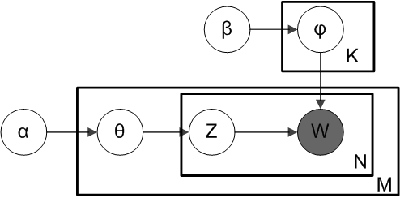

# Latent Dirichlet allocation

## 模型概述

* **notation**

$$\alpha$$ is the parameter of the Dirichlet prior on the per-document topic distributions, $$\beta$$ is the parameter of the Dirichlet prior on the per-topic word distribution, $$\theta _{m}$$ is the topic distribution for document m, $$\varphi _{k}$$ is the word distribution for topic k, $${\displaystyle z_{mn}}$$ is the topic for the n-th word in document m, and $${\displaystyle w_{mn}}$$ is the specific word.

### **Generative process**

1. Choose $${\displaystyle \theta _{i}\sim \operatorname {Dir} (\alpha )}$$, where $$i\in \{1,\dots ,M\}$$ and $$\mathrm {Dir} (\alpha )$$ is a Dirichlet distribution with a symmetric parameter $$\alpha$$ which typically is sparse $$\alpha < 1$$
2. Choose $${\displaystyle \varphi _{k}\sim \operatorname {Dir} (\beta )}$$, where $$k\in \{1,\dots ,K\}$$ and $$\beta$$ typically is sparse
3. For each of the word positions $$i,j$$, where $$i\in \{1,\dots ,M\}$$, and $$j\in \{1,\dots ,N_{i}\}$$

   \(a\) Choose a topic $${\displaystyle z_{i,j}\sim \operatorname {Multinomial} (\theta _{i}).}$$

   \(b\) Choose a word $${\displaystyle w_{i,j}\sim \operatorname {Multinomial} (\varphi _{z_{i,j}}).}$$

We can then mathematically describe the random variables as follows:

$$
{\displaystyle {\begin{aligned}{\boldsymbol {\varphi }}_{k=1\dots K}&\sim \operatorname {Dirichlet} _{V}({\boldsymbol {\beta }})\\{\boldsymbol {\theta }}_{d=1\dots M}&\sim \operatorname {Dirichlet} _{K}({\boldsymbol {\alpha }})\\z_{d=1\dots M,w=1\dots N_{d}}&\sim \operatorname {Categorical} _{K}({\boldsymbol {\theta }}_{d})\\w_{d=1\dots M,w=1\dots N_{d}}&\sim \operatorname {Categorical} _{V}({\boldsymbol {\varphi }}_{z_{dw}})\end{aligned}}}
$$

## 模型求解

模型中涉及到的参数有: $$\theta, \varphi, Z$$, 下面会用 Variational Inference 和 collapsed Gibbs sampling 两种方法进行求解.

### Variational Inference

the total probability of the model is:

$$
{\displaystyle P({\boldsymbol {W}},{\boldsymbol {Z}},{\boldsymbol {\theta }},{\boldsymbol {\varphi }};\alpha ,\beta )=\prod _{i=1}^{K}P(\varphi _{i};\beta )\prod _{j=1}^{M}P(\theta _{j};\alpha )\prod _{t=1}^{N}P(Z_{j,t}\mid \theta _{j})P(W_{j,t}\mid \varphi _{Z_{j,t}}),}
$$

现考虑用如下分解的变分分布: $$q({\boldsymbol {Z}},{\boldsymbol {\theta }},{\boldsymbol {\varphi }}) = \prod \limits_{k=1}^{K}q(\varphi_k) \prod \limits_{i=1}^{M} \{q(\theta_i) \prod \limits_{j}^{N} q(z_{i,j}) \}$$ 对 $$P({\boldsymbol {Z}},{\boldsymbol {\theta }},{\boldsymbol {\varphi }} | {\boldsymbol {W}})$$ 做近似.

利用 mean field theory, 可以得到迭代公式.

* **求解** $$q(\theta_{i})$$

$$
\begin{aligned}
q(\theta_{i}) & = Dirichlet(\alpha^*_1, \alpha^*_2, \dots, \alpha^*_K) \\
where \quad \alpha^*_k &= \alpha + \sum_{j} q(z_{i,j}=k)
\end{aligned}
$$

* **求解** $$q(\varphi_{k})$$

$$
\begin{aligned}
q(\varphi_{k}) & = Dirichlet(\beta^*_1, \beta^*_2, \dots, \beta^*_V) \\
where \quad \beta^*_v & = \beta + \sum_{i,j} 1(w_{i,j}=v)q(z_{i,j}=k)
\end{aligned}
$$

* **求解** $$q(z_{i, j})$$

$$
q(z_{i, j}=k) \propto exp(\psi(\alpha^*_k) - \psi(\sum_k \alpha^*_k) + \phi(\beta^*_{k, w_{i,j}}) - \phi(\sum_{v} \beta^*_{k, v}))
$$

### collapsed Gibbs sampling

Following is the derivation of the equations for collapsed Gibbs sampling, which means $$\varphi$$s and $$\theta$$s will be integrated out.

$$
p(z_{m,n}=k | Z_{-m,n}, W; \alpha, \beta) \propto (\alpha_k+n_{m,(\cdot )}^{k, -(m,n)}) \frac {\beta_{w_{m,n}}+n_{(\cdot ),w_{m,n}}^{k, -(m,n)}}{\sum_v \beta_v+n_{(\cdot ),v}^{k, -(m,n)}}
$$

其中, $$n_{m,(\cdot )}^{k}$$ 表示在文档 $$m$$ 中, 出现主题 $$k$$ 中词的个数, $$n_{(\cdot ),v}^{k}$$ 表示在主题 $$k$$ 中出现的词 $$v$$ 的次数. 上标中的 $$-(m,n)$$ 表示忽略标号为 $$(m, n)$$ 的词.

* **推导细节**

记 $$\Delta(\boldsymbol{\alpha}) = \frac{\prod \Gamma(\alpha_i)}{\Gamma(\sum \alpha_i)}$$.

$$
p(z_{m,n} | z_{-(m,n)}, W) = \frac{p(W, z)} {p(W, z_{-(m,n)})} = \frac{p(W|z)p(z)} {p(W_{-(m,n)}|z_{-(m,n)}) p(w_i) p(z_{-(m,n)})} \propto \frac{p(W|z)}{p(W_{-(m,n)}|z_{-(m,n)})} \frac{p(z)}{p(z_{-(m,n)})}
$$

下面分别求 $$p(W|z)$$, $$p(z)$$ 的表达式.

$$
\begin{aligned}
p(w | z; \beta) & = \int p(w|z, \varphi) p(\varphi | \boldsymbol{\beta}) d\varphi \\
& = \int \prod_{i=1}^{M} \prod_{j=1}^{N} p(w_{i,j}|z_{i,j}, \varphi) \prod_{k=1}^{K} p(\varphi_k | \boldsymbol{\beta}) d\varphi \\
& = \int \prod_{i=1}^{M} \prod_{j=1}^{N} \varphi_{z_{i,j}, w_{i,j}} \prod_{k=1}^{K} \frac{1}{\Delta(\boldsymbol{\beta})} \prod_{v} \varphi_{k,v}^{\beta_v-1} d \varphi \\
& = \int \prod_{k=1}^{K} \frac{1}{\Delta(\boldsymbol{\beta})} \prod_v \varphi_{k,v}^{\beta_v+n_{(\cdot ),v}^{k}-1} d \varphi \\
& = \prod_{k=1}^{K} \frac{\Delta(\beta+n_{(\cdot )}^{k})}{\Delta(\beta)} \quad where \quad n_{(\cdot )}^{k} = (n_{(\cdot ),1}^{k}, \dots, n_{(\cdot ),V}^{k})
\end{aligned}
$$

$$
\begin{aligned}
p(z | \alpha) & = \int p(z | \theta) p(\theta | \alpha) d\theta \\
& = \int \prod_{i=1}^{M} \prod_{j=1}^{N} p(z_{ij}|\theta) \prod_{m=1}^{M} p(\theta_m | \alpha) d \theta \\
& = \int \prod_{i=1}^{M} \prod_{j=1}^{N} \theta_{i, z_{i,j}} \prod_{m=1}^{M} \frac{1}{\Delta(\alpha)} \prod_{k} \theta_{m, k}^{\alpha_k-1} d \theta \\
& = \int \prod_{i=1}^{M} \frac{1}{\Delta(\alpha)} \prod_{k} \theta_{m, k}^{\alpha_k+n_{m,(\cdot )}^{k}-1} d \theta \\
& = \prod_{i=1}^{M} \frac{\Delta(\alpha+n_{m,(\cdot )})}{\Delta(\alpha)} \quad where \quad n_{m,(\cdot )} = (n_{m,(\cdot )}^{1}, \dots, n_{m,(\cdot )}^{K})
\end{aligned}
$$

$$ p\(Z, W \| \alpha, \beta\) = p\(Z \| \alpha\) p\(W \| Z, \beta\) = \prod_{k=1}^{K} \frac{\Delta\(\beta+n_{\(\cdot \)}^{k}\)}{\Delta\(\beta\)} \prod_{i=1}^{M} \frac{\Delta\(\alpha+n_{m,\(\cdot \)}\)}{\Delta\(\alpha\)}

$$
将上面表达式代入到 $$p(z_{m,n} | z_{-(m,n)}, W)$$, 有:
$$

\begin{aligned} p\(z_{m,n} = k \| z_{-\(m,n\)}, W\) & \propto \frac{p\(W, Z \| \alpha, \beta\)}{p\(W_{-\(m,n\)}, Z_{-\(m,n\)}\|\alpha, \beta \)} \ &\propto \frac{\Delta\(\beta+n_{\(\cdot \)}^{k}\)}{\Delta\(\beta + n_{\(\cdot \)}^{k,-\(m,n\)}\)} \frac{\Delta\(\alpha + n_{m,\(\cdot \)}\)}{\Delta\(\alpha + n_{m,\(\cdot \)}^{-\(m,n\)}\)} \ &\propto \frac{\prod_v \Gamma\(\beta+n_{\(\cdot \),v}^{k}\)}{\prod_v \Gamma\(\beta+n_{\(\cdot \),v}^{k, -\(m,n\)}\)} \frac {\prod_k \Gamma\(\alpha+n_{m,\(\cdot \)}^{k}\)}{\prod_k \Gamma\(\alpha+n_{m,\(\cdot \)}^{k, -\(m,n\)}\)} \frac{\Gamma\(\sum_v \beta+n_{\(\cdot \),v}^{k, -\(m,n\)}\)\)}{\Gamma\(\sum_v \beta+n_{\(\cdot \),v}^{k}\)\)} \frac {\Gamma\(\sum_k \alpha+n_{m,\(\cdot \)}^{k, -\(m, n\)}\)}{\Gamma\(\sum_k \alpha+n_{m,\(\cdot \)}^{k}\)\)} \ & \propto \frac {\(\beta_{w_{m,n}}+n_{\(\cdot \),w_{m,n}}^{k, -\(m,n\)}\) \(\alpha_k+n_{m,\(\cdot \)}^{k, -\(m,n\)}\)}{\(\sum_v \beta\_v+n_{\(\cdot \),v}^{k, -\(m,n\)}\)\) \(\sum_k \alpha\_k+n_{m,\(\cdot \)}^{k, -\(m, n\)}\)} \ & \propto \(\alpha_k+n_{m,\(\cdot \)}^{k, -\(m,n\)}\) \frac {\beta_{w_{m,n}}+n_{\(\cdot \),w_{m,n}}^{k, -\(m,n\)}}{\sum_v \beta\_v+n_{\(\cdot \),v}^{k, -\(m,n\)}} \ \end{aligned}

$$

* **Applied to new documents**

LDA 模型训练完成之后, 可以对新来的文档 new document 做 topic 语义分布的计算, 基本流程和 training 的过程完全类似。

对于新的文档， 我们只要认为 Gibbs Sampling 公式中的 $$\hat{φ}_{kt}$$ 部分是稳定不变的，是由训练语料得到的模型提供的，\(即保证topic下word出现次数是固定不变的\) 所以采样过程中我们只要估计该文档的 topic 分布 $$\theta_{new}$$ 就好了。

## 参考资料

* [Latent Dirichlet Allocation](http://www.jmlr.org/papers/volume3/blei03a/blei03a.pdf) by David M. Blei, Andrew Y. Ng, Michael I. Jordan
* [Parameter estimation for text analysis](http://www.arbylon.net/publications/text-est.pdf) by Gregor Heinrich

